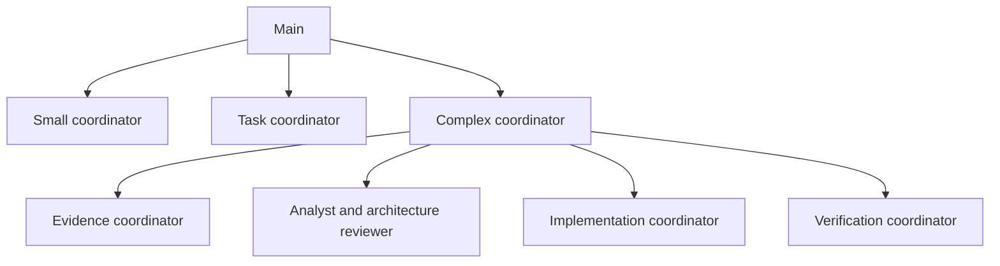

# Versioned orchestration catalog

This directory is the shared, Git-tracked default for Pi Web's Main prompt,
delegation settings, agent profiles, and individually assigned skills. When
running Pi Web **from this checkout**, `npm run dev` (or `npm run start` with a
prepared build) finds this directory automatically. Restart the server and
open a new Main session after pulling roster changes. Check Settings →
Sub-agents for the **Repository** profiles and Settings → Main for the
**Repository** prompt and skills.

For a separately installed Pi Web package, point `PI_WEB_ROSTER_ROOT` at the
absolute directory in a trusted Git checkout. The published package does not
contain `orchestration/`:

```bash
PI_WEB_ROSTER_ROOT="/absolute/path/to/pi-web/orchestration" pi-web
```

The explicit operator variable also overrides the automatically detected
checkout directory. The task project's working directory never selects a
roster. From Settings → Main, edit the shared
Main policy and `APPEND_SYSTEM.md` in the **Repository** scope. From Settings →
Sub-agents, edit **Repository** profiles and shared delegation settings. UI
changes to those sources modify tracked files and still need review, commit,
and publication to Git. Skills are written and reviewed in Git, then assigned
by selecting a specific skill in the agent editor. Local global settings are
for experiments and can shadow shared defaults; the UI shows the effective
source. Trusted project-specific policies can override shared settings.

## Available agents

| Role | Profiles | When they run |
| --- | --- | --- |
| Task coordination | `small-task-coordinator`, `task-coordinator`, `complex-task-coordinator` | Main selects one by impact, uncertainty, and reversibility, never by line count alone. |
| Complex subteams | `evidence-coordinator`, `implementation-coordinator`, `verification-coordinator` | The complex coordinator requests targeted findings, a bounded implementation, then an independent check. |
| Source retrieval | `project-policy-reader`, `project-requirements-reader`, `project-docs-reader`, `project-code-reader` | Read only the project files or supplied issue/design artifacts needed for a concrete question. |
| Analysis | `technical-analyst`, `architecture-reviewer`, `test-planner` | Analyze supplied evidence without file or shell tools; request missing evidence through a permitted provider where configured. |
| Edits | `bounded-writer`, `documentation-writer` | Receive a settled change order and relevant project constraints, then edit within assigned files. |
| Checks | `change-verifier` | Inspect diff and run targeted, non-destructive checks independently of the writer. |

All 16 profiles are **available**, not automatically launched. For a narrow
reversible fix the small coordinator can use just a policy reader, one code
reader, a writer, and a verifier. If requirements, design sources, or
architecture are uncertain, Main can use the medium or complex coordinator.
Even a small code change can have a large blast radius. The reusable skills
(`coordinate-task`, `extract-project-policy`, `trace-project-context`,
`assess-architecture`, `implement-change-order`, `plan-verification`,
`verify-change`) contain role instructions; a skill does not grant a tool.



In the complex path, Evidence can delegate to the policy, requirements, docs,
and code readers. Implementation can delegate to bounded code and documentation
writers. Verification has a test planner and a change verifier. The Analyst
and architecture reviewer can start with a small brief, then ask the parent
for a later handoff from Evidence. A solid delegation edge permits a call; a
strict `depends_on` edge requires an earlier successful result; a
`context_providers` edge permits a *requested* handoff. Edges never start a
child by themselves. The verified graph fits the runtime limit of three agent
levels below Main, with at most 32 active descendants per root and the shared
concurrency setting initially set to 10.

Project-specific approval rules and knowledge belong with their project.
`project-policy-reader` retrieves applicable boundaries, and the coordinator
passes a compact change order to the writer. A remotely hosted issue, pull
request, or Figma design is not accessible to these file-only readers unless
an artifact or verified excerpt is supplied. Architecture review flags choices
for the user; prompts alone are **not** a technical approval gate. The runtime
tool list limits model-visible tools, not operating-system permissions. No
model or Fast setting is hard-coded: test an authenticated model/effort/fast
combination for each role against [evaluation scenarios](../docs/orchestration-evaluation.md)
before committing defaults.
Use the [local release smoke guide](../docs/orchestration-release-smoke.md)
to check new-session behavior, persistence, and cost on the target machine.

## Before removing historical local resources

The five initial agents and this expanded catalog were authored here; we have
not read or imported the operator's Mac files. Follow the
[inventory and reversible smoke guide](../docs/roster-migration.md) after this
code is committed to `develop`. The guide checks both global skill locations,
Main overrides, the prompt, agents, and `agents/settings.json`. Running Pi Web
with the repository root alone does not prove that an older local override or
another application's skill directory can be removed. Existing sessions pin
their old resources; use new sessions to validate the Git defaults.

Linked skill files must remain inside the trusted roster root. Directory links
inside `skills/` are rejected because the SDK recursively follows them and
even an in-root cycle can stall discovery. Keep separately maintained skills
as reviewed files under this catalog until there is a pinned, safe reference
mechanism for external repositories.
