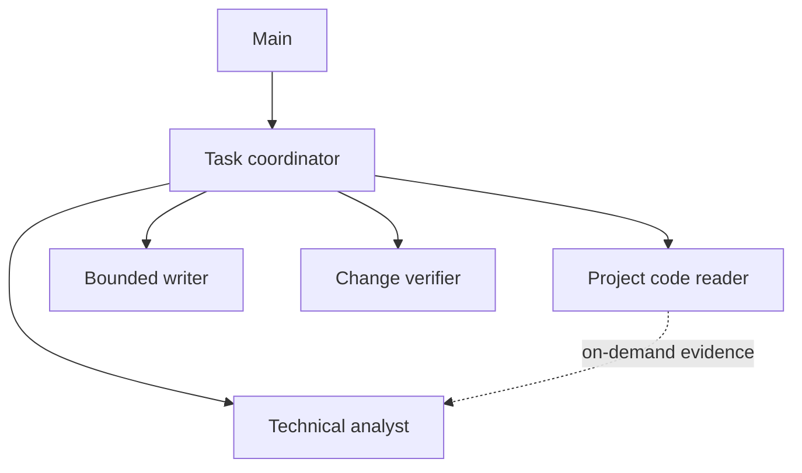

# Orchestration catalog

Profiles in `agents/` and skills in `skills/` are shared across projects when
Pi Web starts with `PI_WEB_ROSTER_ROOT` pointing to the **absolute path** of
this directory. Profiles are editable in Pi Web's Sub-agents panel under the
`roster` scope. Skills stay authored in Git; the UI assigns them to agents.

From the Pi Web checkout, start the development server with:

```bash
PI_WEB_ROSTER_ROOT="$(pwd)/orchestration" npm run dev
```

Set the same environment variable for an installed Pi Web server, pointing
to this checkout's `orchestration` directory. Open Settings → Main to inspect
the shared Main default and any personal or project overrides. Saving a
project override affects only that project's `.pi/main-agent-config.json`;
editing an agent under `roster` affects this catalog directly. New sessions
use the current policy; existing sessions keep their pinned configuration.
Enable Pi Web's built-in sub-agents switch in Settings → Sub-agents before
running the graph.

This example is one bounded software change:



The coordinator starts specialists explicitly. The reader can answer an
analyst's later request through the host-mediated context handoff; it is not
a strict dependency, so the analyst may begin with the supplied context.
The writer receives a concrete change order after the coordinator resolves
or escalates any material decision. The verifier inspects the resulting diff.

No model is hard-coded in these starter profiles. Assign supported models,
thinking levels, and Fast mode in the UI for your provider and budget. Tool
selection narrows what Pi Web exposes but is not an operating-system sandbox.
The roster is a reusable starting point; project-specific rules remain in the
respective project, and reviewers should check source and design artifacts
before each change.

The historical `~/.pi/agent` profiles and skills are not in this catalog.
Review them before any intentional import to this public repository. Do not
replace populated global directories with symlinks.
Links inside the shared `skills/` catalog must remain inside this catalog's
trusted roster root; independently installed global skills remain available
through Pi's usual discovery.
