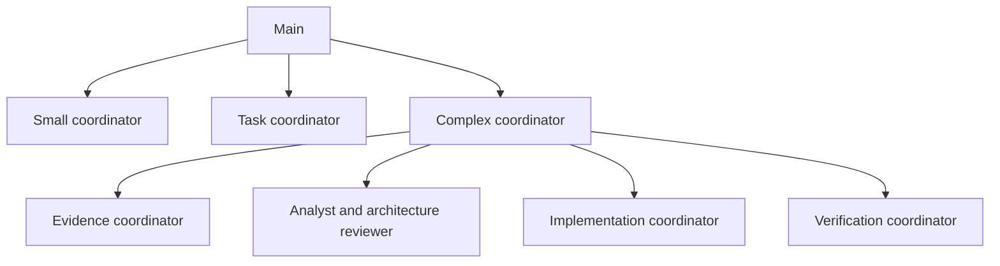

# Versioned orchestration catalog

This directory is the shared, Git-tracked default for Pi Web's Main prompt,
delegation settings, agent profiles, and individually assigned skills. When
running Pi Web **from this checkout**, `npm run dev` (or `npm run start` with a
prepared build) finds this directory automatically. Restart the server and
open a new Main session after pulling roster changes. Check Settings →
Sub-agents for the **Repository** profiles and Settings → Main for the
**Repository** prompt and skills.

For a separately installed Pi Web package, point `PI_WEB_ROSTER_ROOT` at the
absolute directory in a trusted Git checkout. The published package does not
contain `orchestration/`:

```bash
PI_WEB_ROSTER_ROOT="/absolute/path/to/pi-web/orchestration" pi-web
```

The explicit operator variable also overrides the automatically detected
checkout directory. The task project's working directory never selects a
roster. From Settings → Main, edit the shared
Main policy and `APPEND_SYSTEM.md` in the **Repository** scope. From Settings →
Sub-agents, edit **Repository** profiles and shared delegation settings. UI
changes to those sources modify tracked files and still need review, commit,
and publication to Git. Skills are written and reviewed in Git, then assigned
by selecting a specific skill in the agent editor. Local global settings are
for experiments and can shadow shared defaults; the UI shows the effective
source. Trusted project-specific policies can override shared settings.

## Available agents

| Role | Profiles | When they run |
| --- | --- | --- |
| Project questions | `evidence-coordinator` | Main asks for a cited overview or another bounded answer; evidence delegates reading to docs and code readers. |
| Task coordination | `small-task-coordinator`, `task-coordinator`, `complex-task-coordinator` | Main selects one by impact, uncertainty, and reversibility, never by line count alone. |
| Complex subteams | `evidence-coordinator`, `implementation-coordinator`, `verification-coordinator` | The complex coordinator requests targeted findings, a bounded implementation, then an independent check. |
| Source retrieval | `project-policy-reader`, `project-requirements-reader`, `project-docs-reader`, `project-code-reader`, `git-reader` | Read local project evidence, local Git status and patches, or current GitHub issues and PRs. |
| Analysis | `technical-analyst`, `architecture-reviewer`, `test-planner` | Analyze supplied evidence without file or shell tools; request missing evidence through a permitted provider where configured. |
| Edits | `bounded-writer`, `documentation-writer` | Receive a settled change order and relevant project constraints, then edit within assigned files. |
| Checks | `change-verifier` | Inspect diff and run targeted, non-destructive checks independently of the writer. |

All 17 profiles are **available**, not automatically launched. For a narrow
reversible fix the small coordinator can use just a policy reader, one code
reader, a writer, and a verifier. If requirements, design sources, or
architecture are uncertain, Main can use the medium or complex coordinator.
Main's shared configuration assigns no built-in or third-party extension
tools; its model sees only the three Pi Web delegation controls. Session tool
presets cannot add file or shell tools beyond the Main profile. A project
overview goes to the evidence coordinator, which asks the necessary readers
and returns cited findings to Main. Start a **new** Main session to pick up
this policy: existing sessions retain their pinned tool permissions.
Even a small code change can have a large blast radius. The reusable skills
(`coordinate-task`, `extract-project-policy`, `trace-project-context`,
`assess-architecture`, `implement-change-order`, `plan-verification`,
`verify-change`) contain role instructions; a skill does not grant a tool.

## Model and effort defaults

All 17 repository profiles pin an `openai-codex` model and a reasoning level.
The 12 Luna profiles have Fast mode enabled by default; the three Sol and two
Astra profiles have it disabled. Main uses its own session Fast mode setting.
The Main coordinator uses the model selected for its own session; this table
configures its **children**. These are initial allocations by role, not a
measured quality or latency ranking for this roster. Nested orchestrators
cannot change a child's pinned model or effort through `Agent`.

| Profile | Model | Effort | Fast | Reason for the default |
| --- | --- | --- | --- | --- |
| `small-task-coordinator` | Luna | low | on | Route a bounded, reversible task. |
| `task-coordinator` | Luna | medium | on | Manage missing evidence and handoffs. |
| `complex-task-coordinator` | Luna | high | on | Track multi-stage dependencies and decisions. |
| `evidence-coordinator` | Luna | high | on | Reconcile cited code and documentation findings. |
| `implementation-coordinator` | Luna | medium | on | Assign bounded, nonoverlapping edits. |
| `verification-coordinator` | Luna | medium | on | Coordinate independent checks and report gaps. |
| `project-policy-reader` | Luna | medium | on | Extract applicable constraints and approval rules. |
| `project-requirements-reader` | Luna | medium | on | Preserve exact acceptance criteria and source limits. |
| `project-docs-reader` | Luna | low | on | Retrieve named documentation without broad analysis. |
| `project-code-reader` | Luna | medium | on | Find specific symbols and cite observed behavior. |
| `git-reader` | Luna | medium | on | Retrieve current GitHub issues and PRs without write operations. |
| `technical-analyst` | Astra | medium | off | Analyze options and consequences from supplied evidence. |
| `architecture-reviewer` | Astra | high | off | Review consequential architecture and contract decisions. |
| `bounded-writer` | Sol | medium | off | Implement a change order with codebase-specific judgment. |
| `documentation-writer` | Luna | medium | on | Update assigned docs against implemented behavior. |
| `test-planner` | Sol | medium | off | Choose checks that expose failures and regressions. |
| `change-verifier` | Sol | medium | off | Independently inspect a diff and targeted checks. |

Here Luna, Sol, and Astra mean `gpt-6-luna`, `gpt-6-sol`, and `gpt-6-astra`.
The installed Pi SDK 0.87.1 recognizes each under `openai-codex/` and maps
these levels to supported efforts. Ensure all three models are enabled and
the Codex provider is authenticated before starting a child; an unavailable
pinned model fails explicitly. Compare results on identical task scenarios
before changing effort or Fast mode. The runtime pins the Fast setting for a
child session and validates that its model uses a compatible Codex API. Provider
billing is authoritative; the displayed cost can be an estimate if its response
does not report the service tier. API token prices are not a proxy
for a ChatGPT subscription allowance.

The family positioning follows [OpenAI's model guidance](https://developers.openai.com/api/docs/models)
and [GPT-6 Sol/Luna announcement](https://openai.com/index/introducing-gpt-6-sol-and-luna/);
the per-role choices above are our own hypotheses to verify.



In the complex path, Astra analysis is conditional when the technical direction is already clear from user instruction and current specification; independent verification remains required. Evidence can delegate to the policy, requirements, docs,
code, and GitHub readers. Implementation can delegate to bounded code and documentation
writers. Verification has a test planner and a change verifier. The Analyst
and architecture reviewer can start with a small brief, then ask the parent
for a later handoff from Evidence. A solid delegation edge permits a call; a
strict `depends_on` edge requires an earlier successful result; a
`context_providers` edge permits a *requested* handoff. Edges never start a
child by themselves. The verified graph fits the runtime limit of three agent
levels below Main, with at most 32 active descendants per root and the shared
concurrency setting initially set to 10.

The `git_read` tool reports status metadata and staged or unstaged tracked-file patches in the selected session cwd/worktree only; untracked content is not opened. Patches may contain secrets and are returned only as tool output, never logged. Old sessions pin profile IDs and permissions: start a new Main session after the rename; an old `github-reader` snapshot may no longer be delegable because the old profile is not retained as a duplicate.

The `github_read` tool is implemented by Pi Web, assigned only to profiles that
select it, and constrained to read the current project's GitHub `origin`. It
supports listing and fetching issues and PRs, never writes. Public repositories
can be read without authentication (subject to GitHub API limits); for private
repositories, authenticate the `gh` CLI used by Pi Web or provide `GH_TOKEN`
to the Pi Web process. Existing sessions retain their tool snapshot, so start
a new Main session to use the new reader. A GitLab origin is reported as
unsupported rather than treated as GitHub.

Project-specific approval rules and knowledge belong with their project.
`project-policy-reader` retrieves applicable boundaries, and the coordinator
passes a compact change order to the writer. A current issue or pull request
from the project's GitHub origin goes to `git-reader`; other remote sources
and Figma designs still require a supplied artifact or suitable reader.
Architecture review flags choices
for the user; prompts alone are **not** a technical approval gate. The runtime
tool list limits model-visible tools, not operating-system permissions. Model
and effort assignments above need validation against
[evaluation scenarios](../docs/orchestration-evaluation.md) on the operator's
projects; a profile default does not establish measured performance.
Use the [local release smoke guide](../docs/orchestration-release-smoke.md)
to check new-session behavior, persistence, and cost on the target machine.

## Before removing historical local resources

The five initial agents and this expanded catalog were authored here; we have
not read or imported the operator's Mac files. Follow the
[inventory and reversible smoke guide](../docs/roster-migration.md) after this
code is committed to `develop`. The guide checks both global skill locations,
Main overrides, the prompt, agents, and `agents/settings.json`. Running Pi Web
with the repository root alone does not prove that an older local override or
another application's skill directory can be removed. Existing sessions pin
their old resources; use new sessions to validate the Git defaults.

Linked skill files must remain inside the trusted roster root. Directory links
inside `skills/` are rejected because the SDK recursively follows them and
even an in-root cycle can stall discovery. Keep separately maintained skills
as reviewed files under this catalog until there is a pinned, safe reference
mechanism for external repositories.
